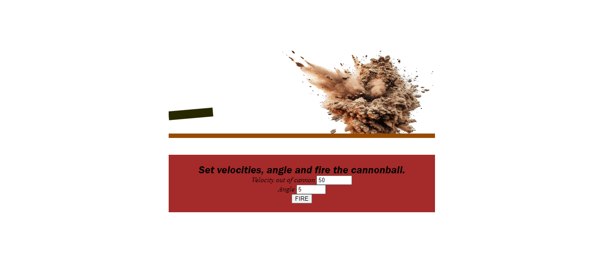
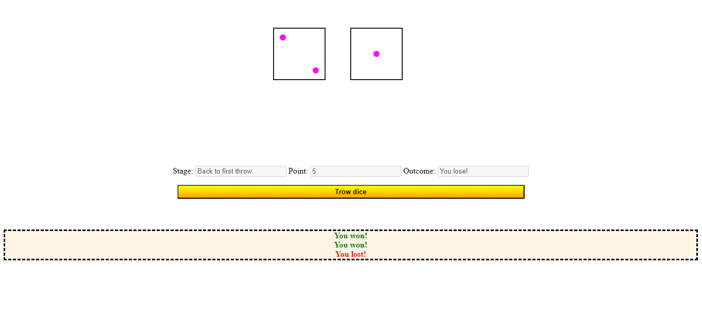
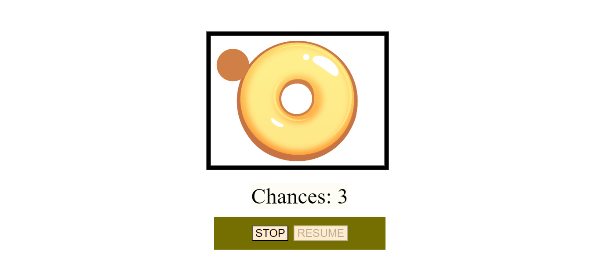
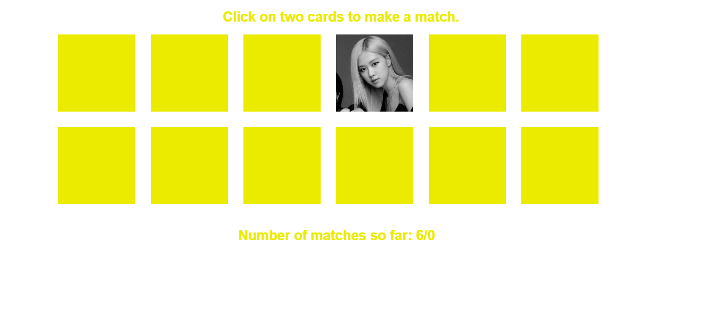

# My Mini-Games Collection

Welcome to my **Mini-Games Collection**! This repository contains four mini-games, each with a unique purpose and gameplay. Below, you’ll find a brief description of each game, how to use them, and some visuals to get a better sense of the gameplay.

## 1. Game One: [Cannon Ball]
### Purpose
The objective of the game is to hit the rock located opposite the cannon.

### How to Play
Choose the velocity of the cannonball by selecting a value between 0 and 100.
Adjust the angle of the cannon using the input field’s arrow keys, allowing for angles between 0 and 80 degrees.
Once you have set the desired velocity and angle, click the "FIRE" button to launch the cannonball.
To restart the game, refresh the page.

### Screenshots

> *This screenshot shows the end of the Cannon Ball game, where the cannonball successfully hits the target rock.*

---

## 2. Game Two: [Craps]
### Purpose
Roll the dice to determine if you win or lose.

### How to Play
Specific game rules will appear in a pop-up at the beginning to guide you through the gameplay.
Click the "Throw dice" button to roll the dice.
The result—whether you win or lose—will be displayed on the screen.
To restart the game, refresh the page.

### Screenshots

> *This image captures the Craps game after several dice rolls.*

---

## 3. Game Three: [Fill-in the Doughnut]
### Purpose
The goal is to align a moving circle inside a doughnut shape. Pause the circle at the center of the doughnut to make it whole.

### How to Play
Use the "STOP" button to pause the chaotically moving circle and the "RESUME" button to resume its movement.
You have three chances to stop the circle in the center of the doughnut.
To restart the game, refresh the page.

### Screenshots

> *This screenshot depicts the beginning of the Fill-in the Doughnut game. The circle is already moving chaotically inside the box, and the player is preparing to use the "STOP" button to align the circle within the doughnut's center.*

---

## 4. Game Four: [K-pop theme memory game]
### Purpose
Match pairs of cards featuring the faces of K-pop groups. There are 6 pairs in total, and your task is to match the cards that feature members of the same group.

### How to Play
Click on a card to flip it over and reveal the image.
Find and click its matching pair. When a correct match is made, the pair will disappear.
Continue until all pairs are matched.
To restart the game, refresh the page.

### Screenshots

> *This image shows the start of the K-pop Theme Memory Game, with all cards face down. The player is ready to begin flipping the cards in search of matching pairs from the same K-pop group.*

## Credits

These mini-games were created by following the step-by-step instructions from the book:

**The Essential Guide to HTML5 Using Games to Learn HTML5 and JavaScript** by [Jeanine Meyer]  
[Apress, 2018]

I want to acknowledge and thank Jeanine Meyer for providing clear and helpful instructions in the book, which guided me through the creation of these mini-games.
---
